[toc]
##最终效果图

##一、词法分析
### 1.1 正则表达式简介
一个文法可以用一个四元来定义，G = { $V_t$，$V_n$，$S$，$P$}
其中 $V_t$ 是一个非空有限的符号集合，它的每个元素成为终结符号。$V_n$ 也是一个非空有限的符号集合，它的每个元素称为非终结符号，并且 $V_t$ ∩ $V_n$=Φ。S ∈ $V_n$，称为文法 G 的开始符号。P 是一个非空有限集合，它的元素称为产生式。所谓产生式，其形式为α → β，α 称为产生式的左部，β称为产生式的右部，符号 → 表示 定义为 ，并且α、β ∈ ($V_t$∪$V_n$)*，
α≠ε，即α、β是由终结符和非终结符组成的符号串。开始符 $S$ 必须至少在某一产生式的左部出现一次。文法可推导的语言标记为 L(G)。
正则文法是一种对应于有限状态自动机的文法。它是在上下文无关文法的基础上满足：A→α|αB（右线性）或 A→α|Bα（左线性)。以整个字母表作为终结符集合 $V_t$。因此正则表达式，正则文法，有限状态自动机这个三个概念虽然指不同的东西，但是具备内在的等价性。
正则表达式就是正则文法，其限制多于上下文无关文法，而高级编程语言的语法都属于上下文无关文法。因此直接通过正则表达式去代码处理、进行语法词法分析是不大可能的。不过，把代码当做纯文本，然后在处理过程中使用多个正则表达式进行匹配，可以有效提高效率。

### 1.2	正规式和 lex 实现原理
Lex 的基本工作原理为：由正规式生成 NFA，将 NFA 变换成 DFA，DFA 经化简后，模拟生成词法分析器。
其中正规式由开发者使用 Lex 语言编写，其余部分由 Lex 翻译器完成。翻译器将 Lex 源程序翻译成一个名为 lex.yy.c 的 C 语言源文件。此文件含有两部分内容：一部分是根据正规式所构造的 DFA 状态转移表。另一部分是用来驱动该表的总控程序 yylex()。其中正规式为一系列正则表达式组成的一系列语法规则。当主程序需要从输入字符流中识别一个记号时， 只需要调用一次 yylex()就可以了。为了使用 Lex 所生成的词法分析器，我们需要将 lex.yy.c 程序用 C 编译器进行编译，并将相关支持库函数连入目标代码。
Lex 源程序必须按照 Lex 语言的规范来写，其核心是一组词法规则（正规式）。一般而言，一个 Lex 源程序分为三部分：定义段、词法规则段、辅助函数段，三部分之间以符号%% 分隔。
定义段可以分为两部分。第一部分以符号%{和%}包裹，里面为以 C 语法写的一些定义和声明：例如，文件包含，宏定义，常数定义，全局变量及外部变量定义，函数声明等。这一部分被 Lex 翻译器处理后会全部拷贝到文件 lex.yy.c 中。在本次实验中，定义和声明如下：
```
%{
#include <string>
#include <sstream>
#include <AST/ast.h>
#include <iostream>
using namespace AST;
#include <cstring>
#include <unistd.h>
#include "tiger_yacc.h"

#define BUFSIZE 65535
#define ADJ {charPos+=yyleng;}

int charPos = 1;
std::stringstream strbuf;
char *strptr = NULL;
int commentDepth = 0;

extern "C" int yywrap(void)
{
 charPos=1;
 return 1;
}
%}
```
第二部分是一组正规定义和状态定义。正规定义是为了简化后面的词法规则而给部分正规式定义了名字。状态定义也叫环境定义，它定义了匹配正规式时所处的状态的名字。状态定义以%S 开始，后跟所定义的状态的名字。
词法规则段列出的是词法分析器需要匹配的正则表达式，以及匹配该正规式后需要进行的相关动作。每行都是一条规则，该规则的前一部分是正则表达式，后一部分是匹配该正规式后需要进行的动作，这个动作是用 C 语法来写的，被包裹在{}之内，被 Lex 翻译器翻译后会被直接拷贝进 lex.yy.c。

### 1.3	Tiger 词法以及 lex 的解析
在 Tiger 语言中，其语法包含以下关键字：
```
array break do end else for function if in let nil of then to type while var
```

并且支持以下操作符： 
```
* / + - & | , . : ; ( ) [ ] { } =< > < <= > >= := =
```

此外 Tiger 语法还支持数字类型、字符串类型、和用户定义 id。以及以/*开头、*/结尾的注释。
因此进行 lex 的正则解析处理如下：
首先排除无用字符，如空格，换行，以及注释等：
```
[ \t]	                {ADJ; continue;}
(\n|\r\n)               {ADJ; /*EM_newline();*/ continue;}
"*"                     {ADJ; return TIMES;}
"/"                     {ADJ; return DIVIDE;}
"/*"                    {ADJ; BEGIN(COMMENT); commentDepth++;}
<COMMENT>{
        "/*"            {ADJ; commentDepth++;}
        "*/"            {ADJ; if (--commentDepth == 0) BEGIN(INITIAL);}
        [^\n]           {ADJ;}
        (\n|\r\n)	{ADJ; /*EM_newline();*/}
}
```
接下来是对关键字、数字、用户定义 id、操作符的处理, 具体可见源文件tiger.l：
```
"array"                 {ADJ; return ARRAY;}
"break"                 {ADJ; return BREAK;}
"do"	                {ADJ; return DO;}
"end"                   {ADJ; return END;}
"else"                  {ADJ; return ELSE;}
    ...
[a-zA-Z][a-zA-Z0-9_]*   {ADJ; tigerlval.sval=new string(yytext); return ID;}
[0-9]+	                {ADJ; tigerlval.ival=atoi(yytext); return INT;}
"+"                     {ADJ; return PLUS;}
"-"                     {ADJ; return MINUS;}
"&"	                {ADJ; return AND;}
"|"	                {ADJ; return OR;}
","	                {ADJ; return COMMA;}
"."                     {ADJ; return DOT;}
    ...
```

再是对字符串类型进行处理，首先定义 STR 状态，当匹配到双引号时，则进入 STR 状态， 开始匹配字符串类型.在 STR 状态中继续进行匹配，如果未遇到下一个未转义的双引号，且符合字符串语法规则，则进行匹配，增加字符串长度。若不符合字符串语法规则则报错。若遇到未转义的双引号，则存储整个字符串，并回到初始状态：

```
\" {ADJ; BEGIN(STR); }
<STR>{
        \" 	        {ADJ; tigerlval.sval=new std::string(strbuf.str());
                                    BEGIN(INITIAL); return STRING;}
        \\n	        {ADJ; strbuf << "\n";}
        \\t		{ADJ; strbuf << "\t";}
        \\^[GHIJLM]	{ADJ; strbuf<<yytext;}
        \\[0-9]{3}	{ADJ; strbuf<<yytext;}
        \\\"    	{ADJ; strbuf<<yytext;}
	\\[\n\t\r\f]+\\ {ADJ;}
        \\(.|\n)	{ADJ; std::cerr << "illegal token" << std::endl;}
        (\n|\r\n)	{ADJ; std::cerr << "illegal token" << std::endl;}
        [^\"\\\n(\r\n)]+ {ADJ; strbuf<<yytext;}
}
```
最后，其他字符为非法字符，匹配到就进行报错。
```
.	                {ADJ; std::cerr << "illegal token" << std::endl;}
```

## 二、语法分析
### 2.1	上下文无关文法简介
上下文无关文法是形式语言理论中一种重要的变换文法，用来描述上下文无关语言，由于程序设计语言的语法基本上都是上下文无关文法，因此应用十分广泛。
上下文无关文法的定义包含以下四部分：终结符号、非终结符号、一个非终结符号作为开始符号、一组产生式。在推导式 a->b 中，字符 a 总可以被字符串 b 自由替换，而无需考虑字符 a 出现的上下文，故为上下文无关。此外，出现在每个产生式左边的符号是非终结符，出现在产生式右边的符号有非终结符和终结符号，但终结符号只出现在右端。
正则文法与上下文无关文法的重要区别在于，在正则文法中是不允许递归定义的，即其左边的 A 必须是一个新的符号，不能在其他地方定义过，且其右边要求每一个符号都是定义过的。而上下文无关文法则没有这个约束。

###2.2	yacc 实现原理
Yacc 使用巴克斯范式(BNF)定义语法，能处理上下文无关文法，采用 LALR(1)的语法分析方法。LR 分析法给出一种能根据当前分析栈中的符号串和向右顺序查看输入串的 k 个符号就可唯一确定分析器的动作是移进还是规约和用哪个产生式规约。这种方法具有分析速度快，能准确，即使地指出出错的位置。

一个 LR 分析器有 3 个部分组成：
总控程序：也可以称为驱动程序。对所有的 LR 分析器总控程序都是相同的。
分析表或分析函数：不同的文法分析表将不同，同一个文法采用的 LR 分析器不同时，分析表也不同，分析表又可分为动作表和状态转换表两个部分，它们都可用二维数组表示。
分析栈：包括文法符号栈和相应的状态栈：它们均是先进后出栈。分析器的动作由栈顶状态和当前输入符号所决定。

Yacc 中包含四种动作：
移进：当 $S_j$ = GOTO[$S_i$，a]成立，则把 Sj 移入到状态栈，把 a 移入到文法符号栈。其中 i，j 表示状态号。
规约：当在栈顶形成句柄为β时，则用β归约为相应的非终结符 A，即当文法中有A-->β的产生式，而β的长度为 r（即|β| = r）,则从状态栈和文法符号栈中自栈顶向下去掉 r 个符号，即栈指针 SP 减去 r。并把 A 移入文法符号栈内，再把满足 $S_j$ =
GOTO[$S_i$，A]的状态移进状态栈，其中 $S_i$ 为修改指针后的栈顶状态。
接受:当规约到文法符号栈只剩文法的开始符号 $S$ 时，并且输入符号串已结束，则为分析成功。
报错：当遇到状态栈顶为某一状态下出现不该遇到的文法符号时，则报错，说明输入串不是该文法能接受的句子。

YACC 文件分为三部分：定义，规则，和辅助函数，通过%%进行分隔。
定义部分包括标志定义和 C 代码。
规则部分定义类似 BNF 语法的规则，规则中目标或非终端符放在左边，后跟一个冒号（：），然后是产生式的右边，之后是对应的动作（用{}包含）。动作由 c 代码完成，即后面的抽象语法部分。
函数部分提供一些辅助的函数。例如当 yacc 解析出错时，会调用函数 tigererror()，用户可自定义函数的实现。在词法分析部分我们定义的错误打印函数。

### 2.3	Tiger 语法以及 yacc 的解析
在 tiger 语言的语法中，包含以下几个部分：
首先是一些变量类型的定义：
```
%union {
  int pos;
  int ival;
  std::string *sval;
  Var *var;
  Exp *exp;
  Dec *dec;
  Type *type;
  Field *field;
  Root *root;
  FunctionDec *functionDec;
  TypeDec *typeDec;
  std::vector<std::unique_ptr<Exp>> *expList;
  std::vector<std::unique_ptr<Dec>> *decList;
  std::vector<std::unique_ptr<Type>> *typeList;
  std::vector<std::unique_ptr<Field>> *fieldList;
  std::vector<std::unique_ptr<FieldExp>> *fieldExpList;
  std::vector<std::unique_ptr<NameType>> *nametypeList;
}
```

然后是ID STRING INT以及词法转换来的，各标识符对应的 token： 
```
%token <sval> ID STRING
%token <ival> INT

%token
  COMMA COLON SEMICOLON LPAREN RPAREN LBRACK RBRACK LBRACE RBRACE DOT
  PLUS MINUS TIMES DIVIDE EQ NEQ LT LE GT GE AND OR ASSIGN
  ARRAY IF THEN ELSE WHILE FOR TO DO LET IN END OF BREAK NIL FUNCTION VAR TYPE
```

再是符合 tiger 语法的非终止符：

```
%type <var> lvalue
%type <root> root
%type <exp> exp let cond
%type <expList> arglist nonarglist explist
%type <type> ty
%type <dec> dec vardec
%type <decList> decs
%type <fieldList> tyfields
%type <field> tyfield
%type <functionDec> fundec
%type <typeDec> tydec
%type <fieldExpList> reclist
%type <sval> id
```

接下来要为一些 token 制定优先级和结合方式。并且建立两个空优先级，一个为最低，
一个为最高，为后面非终止符使用。此处的 token 对优先级和结合方式有明确的要求，比如乘除高于加减高于比较运算高于逻辑运算，加减乘除为左结合，比较运算为不结合等。

```
%nonassoc LOW
%nonassoc THEN DO TYPE FUNCTION ID
%nonassoc ASSIGN LBRACK ELSE OF COMMA
%left OR
%left AND
%nonassoc EQ NEQ LE LT GT GE
%left PLUS MINUS
%left TIMES DIVIDE
%left UMINUS
```

在语法规则开头，建立一个规则开始处，并在此处建立一个指向生成树根的指针。接下来根据 bnf 语法，依次进行语法规则的建立。根据书上给出的全部抽象语法函数定义， 本次实验设计的部分语法规则如下：
```
%start prog

%%

prog:             root                          {root=std::unique_ptr<Root>($1);}
                ;

root:           /* empty */                     {$$=nullptr;}
                | exp				{$$=new Root(std::unique_ptr<Exp>($1));}

exp:              INT                           {$$=new IntExp($1);}
                | STRING			{$$=new StringExp(*$1); delete $1;}
                | NIL				{$$=new NilExp();}
                | lvalue			{$$=new VarExp(std::unique_ptr<Var>($1));}
                | lvalue ASSIGN exp	        {$$=new AssignExp(std::unique_ptr<Var>($1), 
                                                std::unique_ptr<Exp>($3));}
        ...
```
在exp表达式中需要注意的是,对于OR、AND逻辑运算，我们采用的是IfExP句柄来处理
```
                | exp OR exp			{$$=new IfExp(std::unique_ptr<Exp>($1),
                                            std::unique_ptr<Exp>(new IntExp(1)),
                                            std::unique_ptr<Exp>($3));}
                | exp AND exp			{$$=new IfExp(std::unique_ptr<Exp>($1),
                                                      std::unique_ptr<Exp>($3),
                                                      std::unique_ptr<Exp>(new IntExp(0)));}
        ...
```
对于其他二目运算符,我们采用BinaryExp句柄来处理，在规则中，根据 tiger  语法为一些非终止符设定特定的优先级。比如取负运算（-），由于优先级最高，则设为%prec UMINUS，防止出现冲突。
```   
                | exp PLUS exp			{$$=new BinaryExp(BinaryExp::ADD,
                                                    std::unique_ptr<Exp>($1),
                                                    std::unique_ptr<Exp>($3));}
                | exp MINUS exp			{$$=new BinaryExp(BinaryExp::SUB,
                                                    std::unique_ptr<Exp>($1),
                                                    std::unique_ptr<Exp>($3));}
                | exp TIMES exp			{$$=new BinaryExp(BinaryExp::MUL,
                                                    std::unique_ptr<Exp>($1), 
                                                    std::unique_ptr<Exp>($3));}
                | exp DIVIDE exp		{$$=new BinaryExp(BinaryExp::DIV, 
                                                    std::unique_ptr<Exp>($1),
                                                    std::unique_ptr<Exp>($3));}
                | MINUS exp %prec UMINUS	{$$=new BinaryExp(BinaryExp::SUB, 
                                                    std::unique_ptr<Exp>(new IntExp(0)),
                                                    std::unique_ptr<Exp>($2));} 
        ...
```
对于多个token集合的定义，如fieldExpList：
因为yacc使用LALR（1）分析规则，先移进右边的符号，所以在处理list时在最右边新建一个vector，规约的时候把新生成的值放到最右边的vector里，最后再反向。
```
reclist:        /* empty */                     {$$=new std::vector<std::unique_ptr<FieldExp>>();}
                | id EQ exp			{$$=new std::vector<std::unique_ptr<FieldExp>>();
                                                    $$->push_back(llvm::make_unique<FieldExp>(*$1,
                                                        std::unique_ptr<Exp>($3)));delete$1;}
                | id EQ exp COMMA reclist	{$$=$5; $5->push_back(llvm::make_unique<FieldExp>(*$1,
                                                        std::unique_ptr<Exp>($3)));
                                                        delete $1;}
        ...
```
剩下部分的规则类似于如上处理，详细代码可见tiger.y文件中。

##三、 语义分析
在生成抽象语法树之后，我们接下来需要实现语义分析和生成中间代码。我这里会对抽象语法树进行两次扫描，而不是在语义分析的过程中同时进行着中间代码的生成。

在语义分析阶段，我们分析进行类型检查，即一个变量的类型是否定义，赋值时候是否赋上正确的值，以及变量在使用时候是否已经被定义、函数在使用的时候是否定义，以及生成函数的静态链和栈帧。

再具体实现时候，有几个值得注意的问题：
###3.1 递归类型
在Tiger里面，我们支持支持类型的递归，也就是说可以实现以下的代码：
    ```pascal
    type tree = {key: int, children: treelist}
    type treelist = {hd: tree, t1: treelist}
    ```
在这里，我们会发现，类型`tree`在定义的时候，它的子类型`treelist`却没有定义。如果边进行语义分析边生成代码的话，类型`tree`不能即时构建。因此我们需要在类型定义时候，只把类型放入类型定义符号表而不直接生成该类型。
那么类型在什么时候生成呢？我把它推迟到使用该类型时候再进行生成。也就是说，在检查到如下语句时候：
    ```ts
    var x : tree := nil
    ```
这时候发现`x`的类型为`tree`，然后从类型定义符号表中获取`tree`类型的定义，然后再生成该类型，然后把生成的类型放入类型符号表中（不同于类型定义符号表）。那么下次再使用该类型的时候就不会重新生成了。

 此外我们还要检查类型定义没有循环，即
    ```pascal
    type a = b
    type b = a
    ```
这种语句应该报错。
实现这种检查也是很简单的，我们咋递归定义类型的时候，把自己的名字以及父亲节点的类型名字放入一个集合中，如果发现自己的名字出现在这个集合中，则表示出现递归的。

所以在语义检查时候，关于类型，我们需要两张表，一张是缓存变量定义的抽象语法树节点，一张是用来储存生成之后的LLVM类型。并且，对于每个变量定义，储存它对应的LLVM类型，用于中间代码生成时候使用。

具体实现的伪代码如下:
```c++
auto Table<TypeDec> typeDecs;
auto Table<llvm::Type> types;
void TypeDec::traverse(set<string> parentValues) {
    if(parentValues.contains(name)) {
        error("recursive");
    }
    typeDecs.push(name, this);
    parentValues.push_back(name);
    for(auto &child: children)
        child->traverse(parentValues);
}
```

###3.2 栈帧和静态链的实现
Tiger语言是支持函数嵌套定义的，也就是说，函数内部支持定义子函数，并且在子函数内部，我们是可以访问父函数的节点的。也就是说以下的写法是合法的：
    ```pascal
    let 
        function x(a:int) : int = 
        let
            function y(b:int) : int = 
                a + b
        in
            x(a)
    in
        x(1)
    end
    ```
这里函数`y`使用了它的父函数`x`的局部变量。这个访问需要通过静态链来实现。

但是在llvm中，函数并不支持静态链。也就是说，即使我们记录下父函数的变量地址，在子函数里面访问的时候，子函数也是访问不了的。经过测试，我们发现在生成中间代码时候，子函数根据SSA变量名在自己栈帧中访问变量时候，发现并没有这个变量，于是报错。

而且，llvm中我们很难获取一个平台无关的函数的栈帧地址，即使能获得，也很有可能因为平台原因很难算出变量在栈帧中的偏移以获取内存。
并且，我们不能没有显式告诉llvm改变量是否逃逸，在优化后，很可能该变量已经不在内存中了。
所以我们必须实现一个平台无关的伪栈帧和静态链。

---

首先，根据课程内容，我们知道，一个函数的栈帧中，有参数、局部变量、动态链（返回地址）、以及静态链。在LLVM中，动态链是本来就实现好的，我们没有必要、也很难自己实现一个动态链。因此我们实现的伪栈帧中需要包含参数和局部变量、动态链。
实现上，我们采用了llvm里面的Struct类型，对应Tiger中的Record类型，来实现我们的栈帧。其中这个Struct中有该函数的静态链以及所有的局部变量和参数。比如上例子中，函数y的栈帧Struct中，应该按序有以下内容：
1. 函数x的栈帧地址（静态链）
1. 局部变量b

但是问题又来了。Tiger中是的变量嵌套定义的。即一个`let`中可能还有`let`。我们怎样才能知道函数内部一共有多少局部变量？另外，llvm中，我们访问一个Struct的成员变量时候，只能通过数字下标访问，我们不能通过名字进行访问。再者，如果我们访问外层的变量时候，我们需要一层一层剥开静态链进行访问，我们如何才能知道这个变量在那一层？同理，我们调用函数时候需要给函数传入其父函数的静态链，我们又如何获取其父函数的静态链？

-------

前面提到我们用两次扫描，其中一个理由就在这里。我们在第一次扫描的时候，除了进行语义分析、为变量生成实际类型之外，我们还需要算出定义的这个变量在第几层中，属于这一层的函数的第几个变量。这样在生成中间代码的时候，我们才能够正确实现类型通过静态链访问。
具体实现非常简单，在遍历抽象语法树的时候，我们会传入一个向量，该向量在每个函数定义时候新建一个，并且在遍历完成之后保存起来。向量的内容为在自己作用域内定义的所有变量。变量在定义时候，会自觉把自己添加到这个向量中。那么在生成中间代码的时候我们就可以利用这个向量生成栈帧了。
此外，还需要在没定义一个函数的时候当前层数加一，在退出时候减一。在变量定义的时候，记录当前层数。
注意一点就是，除了变量定义以外，在`for`语句中我们也会隐式定义一个变量的，这个也同样实现就可以。
具体实现的伪代码如下：
```c++
llvm::Type *VarDec::traverse(set<VarDec> varTable) {
    varTable.push(name, this);
    level_ = level;
    // ...
}

llvm::Type *FunDec::traverse(set<VarDec> /*ignore*/){
    level_ = ++level;
    for(auto &child: children) {
        child->traverse(varTable_); // Use its own table
    }
    // ... 
}
```

---
此外还有一个需要注意的点是，Tiger中是有一些内建函数的。在调用内建函数和用户定义函数时候，需要进行一定的区分。因为内建函数是使用C语言写的，不需要把静态链参数传进去。而在调用用户定义函数时候，需要把静态链传进去。这个在语义分析过程中，进行函数调用检查时候需要注意的。
伪代码实现如下：
```c++
llvm::Type *CallExp::traverse() {
    callee = functions[func_];
    if(callee is external) {
        check(params.size(), callee->params.size())
    } else {
        check(params.size(), callee->params.size() - 1)
    }
    // ...
}
```

###3.3 类型检查
语义分析中还有一个比较重要的内容就是类型检查。在遍历抽象语法树的过程中，正如上诉伪代码一样，我们每个节点都会返回一个llvm类型。我们只需要对这个类型是否匹配进行检查就可以了。
比如在赋值语句中，伪代码实现如下：
```c++
llvm::Type *AssignExp::traverse() {
    auto left = left_->traverse();
    auto right = right_->traverse();
    if(left != right)
        return logError("Type not match");
    return right;
}
```
不同节点有不同的实现，比如ExpList是使用最后一个语句的类型；Call是函数的返回类型等等，这里就不再赘述了。
不过有一个值得注意的地方是，`nil`和`Record`的类型判别并不是简单地判断不相等。因为不同`Record`可能有相同的值，而`nil`与所有`Record`兼容！
所以在遇到`Record`类型和`nil`类型的时候，我们要特殊判断，伪代码如下：
```c++
bool isMatch(llvm::Type *a, llvm::Type *b) {
    if(a == b) return true;
    else if(isNil(a) || isNil(b)) {
        if(isRecord(b) || isRecord(a))
            return true;
        else return false;
    }
    else if(isIsomorphic(a, b)) {
        return true;
    }
    return false;
}
```

##四、 中间代码生成
有了语义分析对抽象代码树进行第一次扫描之后，我们抽象代码树就多出了很多对中间代码生成有用的信息了：
- 每个定义的变量的直接类型
- 变量的访问层次、访问偏移
- 每个函数的声明
- 每个函数的所有局部变量
- 各种语句的类型均匹配

有了这些信息之后，我们中间代码实现的工作就相对简单很多了。
在实现时候，我们需要注意实现以下几点：


###4.1 最外层隐含main函数
由于一个Tiger程序就是一个表达式，那么最外层变量没有栈帧，并且运行生成目标代码之后，会缺少程序入口，所以我在最外层隐含了一个main函数，这样生成的目标代码在链接之后就能直接运行了。而且对于最外部的变量和函数都能通过静态链很容易地实现。

- 通过静态链访问变量。
    我们在遍历过程中，需要对函数的静态链类型进行保存，然后使用llvm的`GetElementPtr`一层一层解开到最后一层静态链，然后对变量进行访问。
    具体实现伪代码如下：
    ```c++
    std::deque<llvm::StrcutType*> staticLinkType;

    llvm::Value *VarDec::read() {
        auto level = currentLevel;
        auto value = currentFrame;
        while (level-- > level_) {
            value = builder.CreateGEP(llvm::PointerType::getUnqual(*++staticLinkType),
                                  value, zero, "staticLink");
            value = context.builder.CreateLoad(value, "frame");
        }
        return context.builder.CreateGEP(type_, value, offset_, name_);
    }
    ```

###4.2 函数定义
在函数定义的时候，我们需要相应地更新`currentLevel`和`currentFrame`和`staticLinkType`以为函数体内的变量访问提供信息。此外，我们还需要把最外层函数的基本块记录下来，以实现函数定义完成之后回到父函数中继续实现父函数。
所以我们的具体工作如下：
- 在真正栈帧中创建伪栈帧
- 记录原值然后更新以上三个变量
- 记录当前基本快，新的函数基本快
- 保留参数到伪栈帧中
- 函数体递归生成
- 恢复三个变量原值
- 恢复基本块

具体伪代码实现如下：
```c++
llvm::Value *FunctionDec::codegen() {
    // 1
    frame = builder.alloca(staticLinkType_);
    // 2
    auto oldFrame = currentFrame;
    currentLevel++;
    currentFrame = frame;
    staticLinkType.push(staticLinkType_);
    // 3
    auto oldBB = builder.CurrentBlock();
    auto BB = builder.CreateBasicBlock()
    // 4
    for((arg, param) : (args_, params_)
        builder.CreateStore(param, arg->read());
    // 5
    body_->codegen();
    // 6
    currentLevel--;
    currentFrame = oldFrame;
    staticLinkType.pop();
    // 7
    builder.SetInsertPoint(oldBB);
}
```

###4.3 控制块实现
循环和条件语句中，我们都需要生成一系列的基本快，配合跳转指令实现循环和条件语句。
我把循环语句分成四个部分：
- test: 测试语句，测试条件是否成立
- body: 循环体
- next: 执行下一次循环前需要完成的操作，一般是循环变量的递增
- after: 循环结束之后的语句

基本快之间的跳转如下：
- test: 如果条件满足，跳转到body, 否则跳转到after
- body: 跳转到next
- next: 跳转到test

在For循环中，next用于递增循环变量，而while语句直接跳转到test。

另外，之所以把循环体分成body和next是为了实现`continue`语句。`continue`语句是跳转到next的，而`break`是跳转到after的。

为了实现`break`和`continue`，我们还需要维护一个循环栈，用于跳出最近一个循环。另外有了这个栈，我们还可以实现像Java一样的多重循环的跳转。

---
控制语句实现也一样。分成三部分
- test: 测试条件是否成立
- then: 成立时候执行
- else: 不成立时候执行（可选）
- merge: 控制语句后的语句

基本块的跳转如下：
- test: 条件成立则跳转到then，不成立则跳转到else
- then: 跳转到merge
- else: 跳转到merge

###4.4 函数调用
函数调用需要获取被调用者的父函数静态链作为第一个参数传给函数，这个获取其实与变量访问差不多，只是大于号换成大于等于号（需要获取其父函数的静态链）。当然我们还需要判断一下内建函数，是没有静态链的。
实现的伪代码如下：
```c++
llvm::Value *CallExp::codegen() {
    auto level = currentLevel;
    auto value = currentFrame;
    while (level-- >= level_) {
        value = builder.CreateGEP(llvm::PointerType::getUnqual(*++staticLinkType),
                                value, zero, "staticLink");
        value = context.builder.CreateLoad(value, "frame");
    }
    args = std::vector<llvm::Value*>(params_.size())
    for(auto (arg, param): (args_, params_)) {
        arg = param;
    }
    if(!function.builtin())
        args.push_front(value);
    return builder.CreateCall(function, args);
}
```

###4.5 数组和记录的右值
Tiger语言支持生成数组和记录的右值类型复给一个左值。在Tiger中，有数组和记录可以动态生成，所以我们不能在栈中分配这个空间，只能在堆中申请空间。我们为此实现了两个内建函数：`void *allocaArray(size: int, num: int)`和`void *allocaRecord(size: int)`.
其中数组中有两个参数，原始类型的空间大小和数量，记录只有一个大小信息。分配的空间不会进行初始化。调用这两个内建函数之后，我们转换指针类型，然后生成初始化成员的代码就可以了。
其中数组的初始化我们跟循环实现一样，遍历每个成员。对于记录，我们可以静态生成每个成员的初始化代码。
其中记录的具体实现如下：
```c++
llvm::Value *RecordExp::codegen() {
    auto ptr = builder.CreateCall(allocaRecordFunction, size), "ptr");
    size_t idx = 0u;
    for (auto &field : fieldExps_) {
        auto exp = field->codegen(context);
        auto elementPtr = context.builder.CreateGEP(
                field->type_, var, idx, "elementPtr");
        builder.createStore(exp, elementPtr);
        ++idx;
    }
}
```
数组的实现中因为循环设计较多基本快这里就不列出伪代码了。调用内建函数之后就跟循环语句实现非常类似了。
    
##五、 目标代码生成
在llvm中，只要我们生成号中间代码之后，就能够很简单地生成目标代码了。
由于我们不需要交叉编译，所以我们需要获取本机的一些信息，然后就可以生成目标代码了。
但是生成后的目标代码还需要链接过程。直接链接我们是不能链接成功的，因为我们还要一些内联函数的实现。我用C编写了一个内联函数的定义`runtime.cpp`，所以生成的目标代码`output.o`最后生成可执行文件需要：
```Makefile
$(CC) output.o rumtime.o
```
这样链接之后就可以直接运行生成的可执行文件了。

##六、 语法树可视化

###6.1 总体流程

语法树的可视化是一个递归的过程，每个节点都有printTree()的方法，并且需要知道自己所在的层次，在遍历AST树的同时，打印节点本身。基本流程如下：

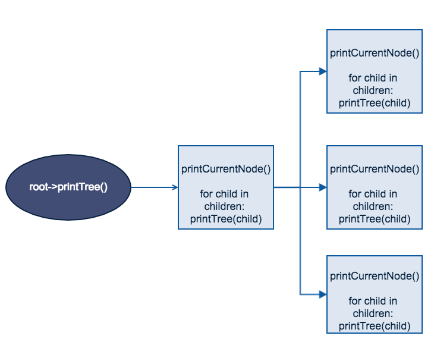

###6.2 数据结构

在可视化时，每个AST节点可以抽象成一个Node，Node声明一个纯虚接口printTree()，然后各个节点依次去实现这个方法，用动态绑定来实现不同节点的差异化表示。以下是主要数据结构：

* Node

  ```cpp
  class Node {
    size_t pos_;
  
   public:
    virtual ~Node() = default;
    virtual Value *codegen() = 0;
    void setPos(const size_t &pos) { pos_ = pos; }
  
    virtual void print(QTreeWidgetItem *parent, int n) = 0;
  };
  ```

* Var

  ```cpp
  class Var : public Node {
   protected:
    QString icon = ":/icon2.png";
  };
  ```

* Exp

  ```cpp
  class Exp : public Node {
   protected:
    QString icon = ":/icon3.png";
  };
  ```

* Root

  ```cpp
  class Root : public Node {
    unique_ptr<Exp> root_;
    vector<VarDec *> mainVariableTable_;
  
   protected:
    QString icon = ":/icon1.png";
  
   public:
    Root(unique_ptr<Exp> root) : root_(move(root)) {}
    Value *codegen(CodeGenContext &context) override;
    llvm::Type *traverse(vector<VarDec *> &variableTable,
                         CodeGenContext &context) override;
    void print(QTreeWidgetItem *parent, int n) override;
  };
  ```

* Dec

  ```cpp
  class Dec : public Node {
   protected:
    string name_;
    QString icon = ":/icon4.png";
  
   public:
    Dec(string name) : name_(move(name)) {}
  };
  ```

* Type

  ```cpp
  class Type {
   protected:
    string name_;
    QString icon = ":/icon5.png";
  
   public:
    Type() = default;
    void setName(string name) { name_ = move(name); }
    const string &getName() const { return name_; }
    virtual ~Type() = default;
    virtual llvm::Type *traverse(std::set<string> &parentName,
                                 CodeGenContext &context) = 0;
    virtual void print(QTreeWidgetItem *parent, int n) = 0;
  };
  ```

    其他节点都是这些节点的派生，表示不同的变量、表达式、类型、声明等，AST结构的UML如下：

    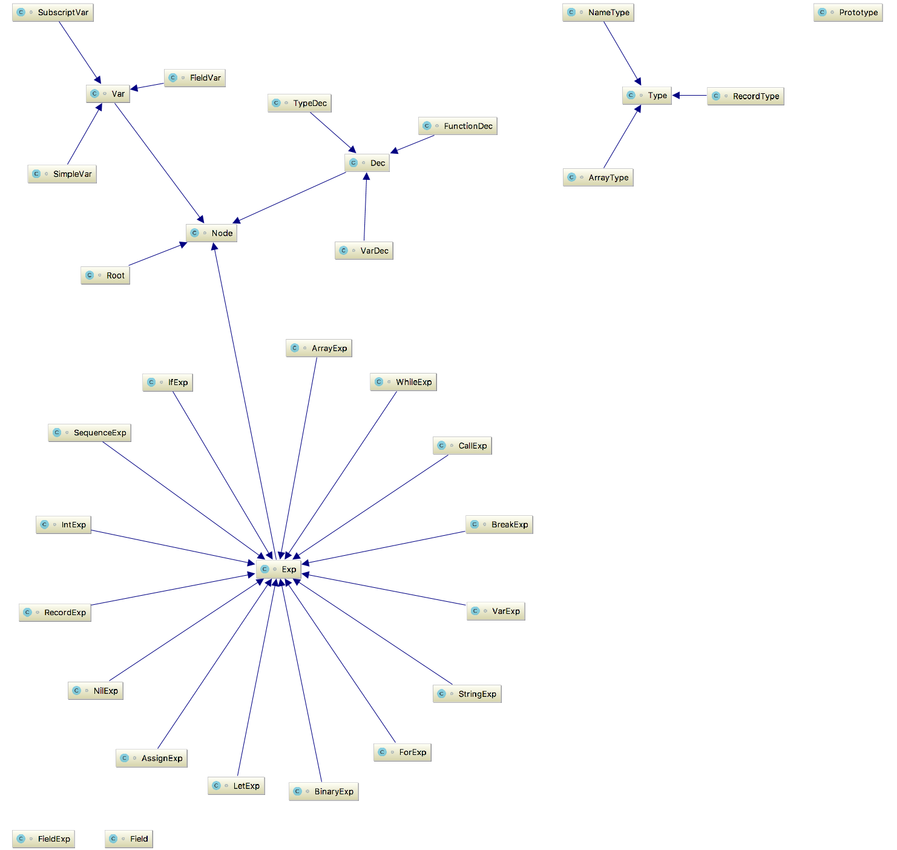


###6.3 yaml格式

YAML是"*YAML Ain't Markup Language*"的外语缩写 ，为了强调这种语言以数据做为中心，而不是以置标语言为重点，而用返璞词重新命名。它是一种直观的能够被计算机识别的数据序列化格式，是一个可读性高并且容易被人类阅读，容易和脚本语言交互，用来表达资料序列的编程语言。

它是类似于标准通用标记语言的子集XML的数据描述语言，语法比XML简单很多。

由于AST树是通过递归打印，因此可以直接通过缩进的形式，生成yaml。这是对字符串标准输出的操作，使用python脚本可以完成转换

如以下的tiger代码

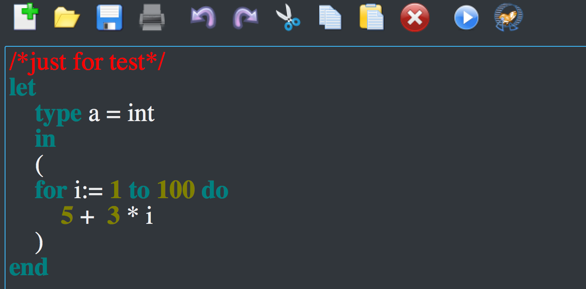

会被直接转化成yaml格式

```yaml
Root:
   LetExp:
      TypeDec:
         NameType:
            name: int
      SequenceExp:
         SequenceExp:
            ForExp:
               var: i
               IntExp:
                  val: 1
               IntExp:
                  val: 100
               BinaryExp:
                  op: '+'
                  IntExp:
                     val: 5
                  BinaryExp:
                     op: '*'
                     IntExp:
                        val: 3
                     VarExp:
                        SimpleVar:
                           name: i

```

###6.4 JSON格式

JSON（JavaScript Object Notation， JS 对象简称） 是一种轻量级的数据交换格式。它基于 ECMAScript （欧洲计算机协会制定的js规范）的一个子集，采用完全独立于编程语言的文本格式来存储和表示数据。简洁和清晰的层次结构使得 JSON 成为理想的数据交换语言。 易于人阅读和编写，同时也易于机器解析和生成，并有效地提升网络传输效率。

JSON的处理方法类似，使用python脚本在yaml的形式上做进一步结构化，先把yaml序列化成python的dict类型，然后再把dict数据序列化成JSON，上述代码最后变成如下形式：

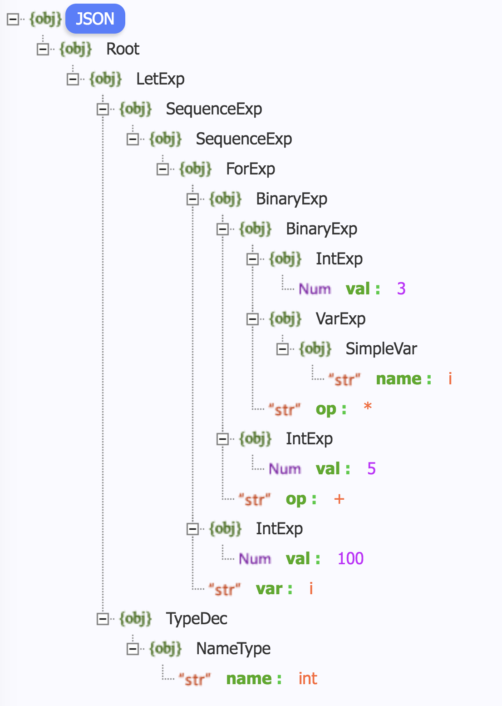

###6.5 Qt控件直接可视化

除了文件导出外，我们还希望Tiger-IDE能在运行过程中自动生成结构，方便实时查看，解决方法是采用TreeWidget来呈现，在递归遍历AST树的时候动态创建节点，在创建子节点的时候传入父节点，新的子节点依附在父节点上，从而在printTree()运行完毕后，TreeWidget也完成节点的增加，以FieldRecord节点为例：

```cpp
void RecordExp::print(QTreeWidgetItem *parent, int n) {
  blank(n);
  cout << "RecordExp:" << endl;
  // 创建节点，依附在父节点下
  QTreeWidgetItem *cur = add_node(parent, "RecordExp", icon);

  type_->print(cur, n + 1);
  for (auto &fieldExp : fieldExps_) {
     // 遍历子节点，并传入自身节点作为子节点的父节点
     fieldExp->print(cur, n + 1);
  }
}
```

另外，对于不同类型（Var、Exp、Root、Dec、Type），还是用了不同的icon加以区分

最终效果如下：

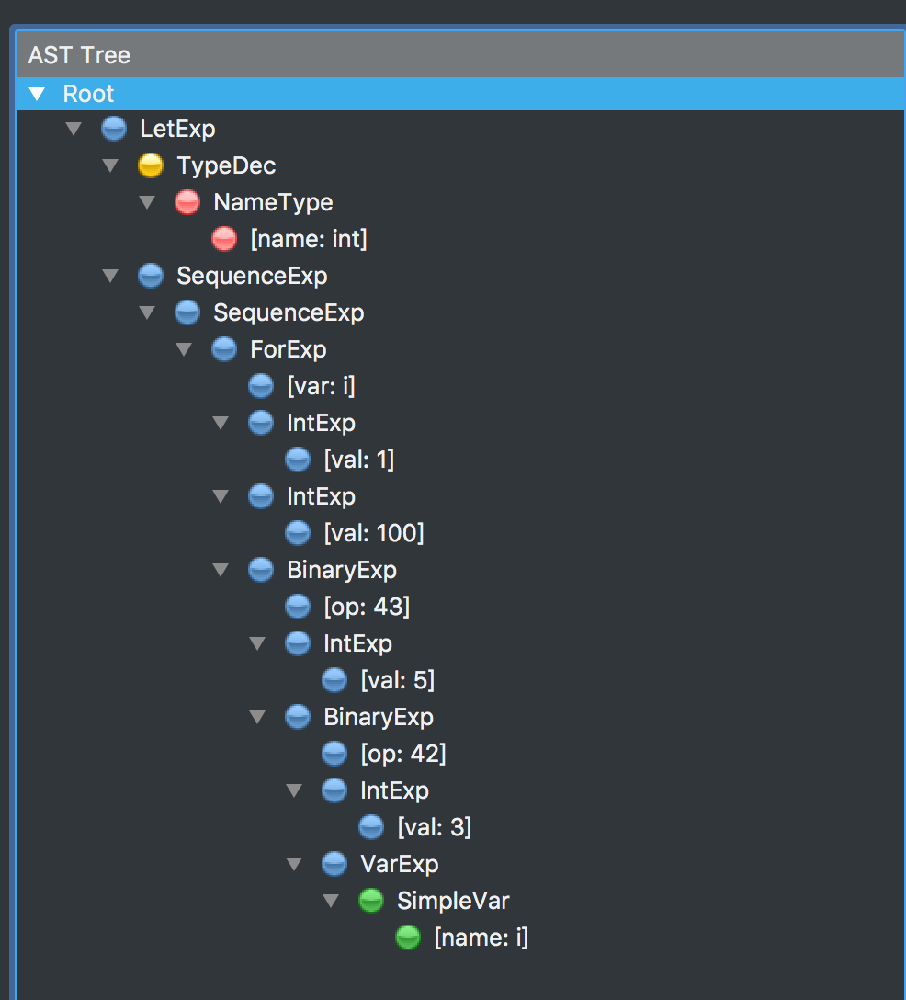

##七、 IDE设计

###7.1 模块结构

模块分为三个部分：

* compiler对象用于实现和编译器的连接
* highlighter对象实现代码编辑时的语法高亮
* mainwindow对象是主对象，实现UI，接受用户响应，使用MVC架构
* 其他
  * qss实现UI的样式
  * res.qrc实现静态文件的资源管理

        **➜  IDE git:(llvm) ✗** tree

        .

        ├── compiler.cpp

        ├── compiler.h

        ├── highlighter.cpp

        ├── highlighter.h

        ├── mainwindow.cpp

        ├── mainwindow.h

        └── mainwindow.ui

        0 directories, 7 files

### 7.2 UI设计

界面设计分为几个部分：

1. 工具栏：包含文件的基本打开、保存、另存为操作，复制、粘贴、撤销、重做等编辑操作，设置当前字体、背景色，还支持编译运行
2. 编辑栏：用于编写tiger语言，有代码高亮
3. 输出栏：输出编译运行的结果
4. AST栏：用于可视化语法树


###7.3 功能实现

逻辑实现采用MVC设计模式，MainWindow接收用户的操作，接收输入信号之后执行对应的操作。项目的核心Compiler被封装成一个类，MainWindow持有这个函数的一个实例，逻辑实现如下：

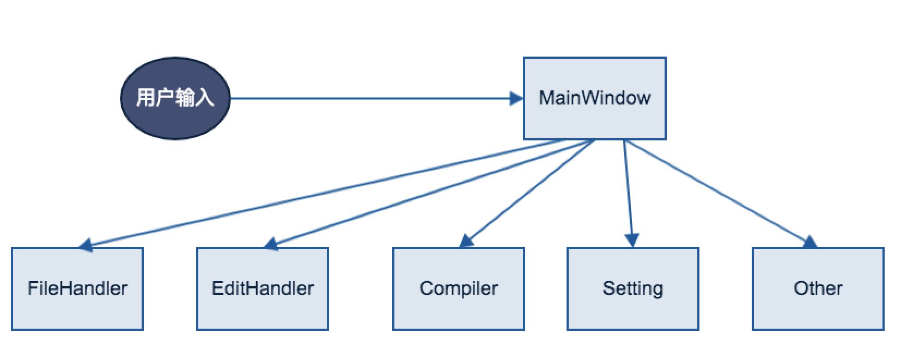


#### 编译运行
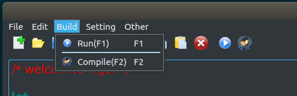


#### 文件操作
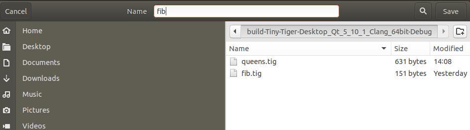


#### 编辑功能
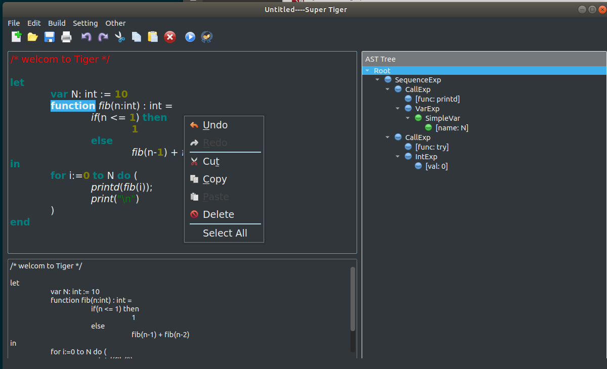

##八、重点工作

* 多种形式的数据可视化，使用QTreeWidget控件，支持导出yaml、json
* 设计Tiger语言对应的IDE，大大提高了开发测试的效率，结果更加友好
* 静态链的实现
  
##九、测试案例
###1. 简单语句测试
- 赋值语句
    ```pascal
    let
        var a := 8
        var b := 1
        var c := a + b
    in  printd(c)
    end
    ```
    生成的中间代码：
    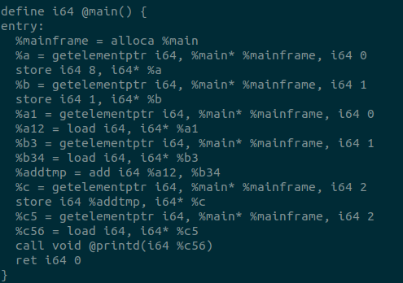
    运行结果：
    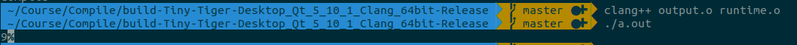
    可以看到运行结果为9，正确。

- 条件语句
    ```pascal
    let 
        var M := 1
        var N := 2
    in  printd(if N < M then M else N)
    end
    ```
    生成的中间代码：
    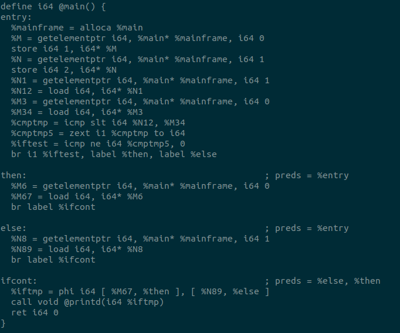
    运行结果：
    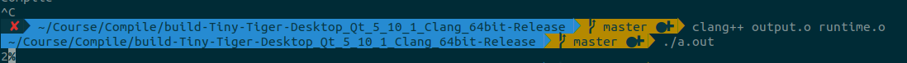
    可以看到运行结果为2，正确。

- 循环语句
    ```pascal
    let 
        var N := 5
        var sum := 0
    in  (for i := 0 to N - 1
            do sum := sum + i;
        while N:= N-1 do printd(sum)
        ) 
    end
    ```
    生成的第一个循环中间代码：
    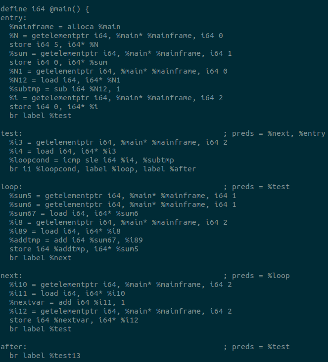
    第二个循环的中间代码
    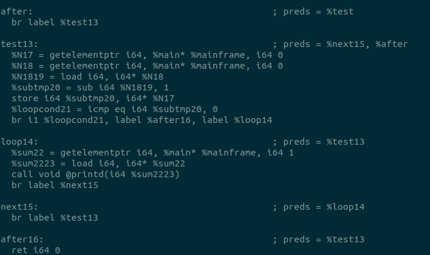
    运行结果：
    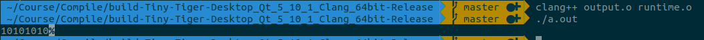
    可以看到运行结果为10101010，正确。


- 函数调用
    ```pascal
    let
        function comparision(a:int, b:int) =
            if a > b then printd(a)
            else printd(b)
    in comparision(1 ,2)
    end     
    ```
    生成的中间代码：
    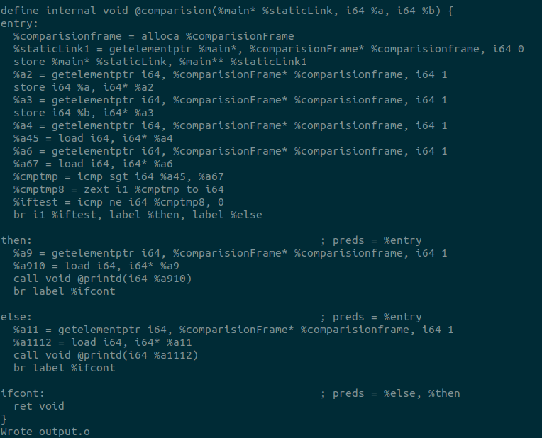
    运行结果：
    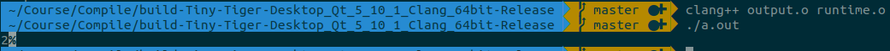
    可以看到运行结果为2，正确。

- 数组
    ```pascal
    let
        type  arrtype = array of int
        var arr:arrtype := arrtype [10] of 0
    in (
        arr[1] := 1;
        for i := 0 to 3 do printd(arr[i])
    )
    end
    ```
    生成的数组中间代码：
    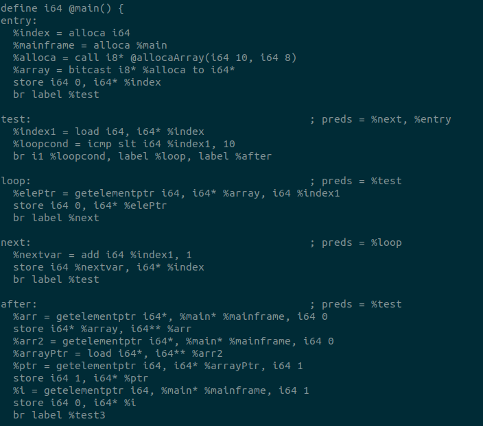
    循环输出的中间代码：
    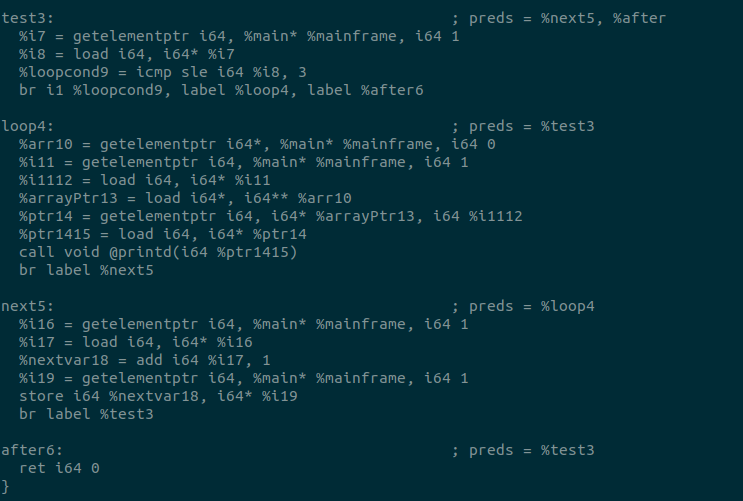
    运行结果：
    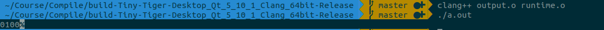
    可以看到运行结果为0100，正确。


- 记录
    ```pascal
    let
        type  rectype = {name:string, age:int}
        var rec1:rectype := rectype {name="Nobody", age=1000}
    in (
        rec1.name := "Somebody";
        print(rec1.name);
        printd(rec1.age)
    )
    end
    ``` 
    生成的中间代码：
    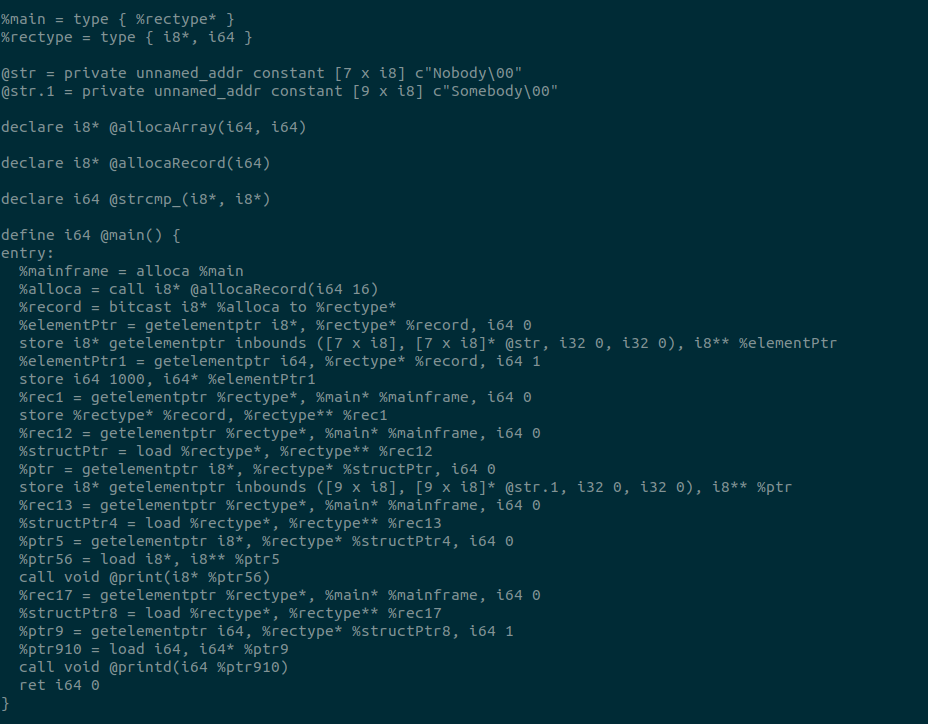
    运行结果：
    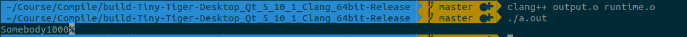
    可以看到运行结果为Somebody1000，正确。

- 静态链
    ```pascal
    let
    var a: int := 1
    var b: int := 2
    function t(s: int) =
        printd(s)
    function x(i:int) : int =
        let
            function y(j:int) : int = (
                t(i + j + b);
                a
            )

        in
            y(i+a)
        end

    in x(a+b)
    end
    ```
    生成伪栈帧的中间代码：
    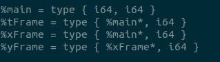
    主函数的中间代码
    
    其他各个函数的代码
    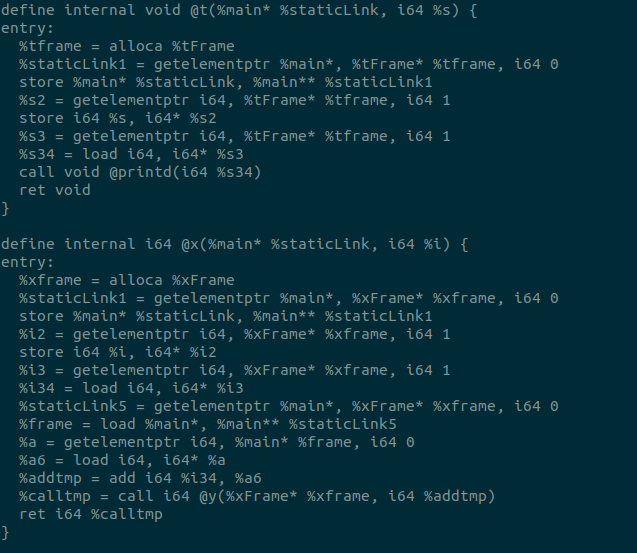
    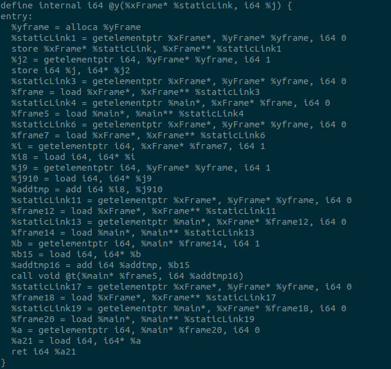
    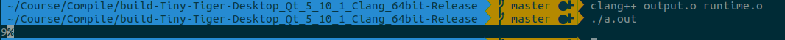
    运行结果：
    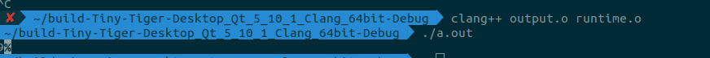
    可以看到运行结果为9，正确。


###2. 复杂组合语句测试
- Fibonacci数列
    ```pascal
    let 
        var N:=10
        function fib(n:int):int = 
            if n<=1 then 1
            else fib(n-1) +fib(n-2)
    in 
        for i:= 1 to N do (
            printd(fib(i));
            print("\n")
        )
    end
    ```
    运行结果：
    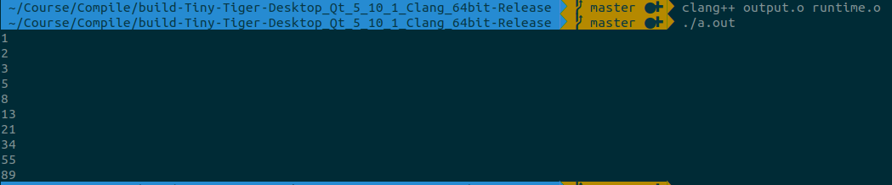
    可以看到运行结果正确。

- 八皇后
    ```pascal
    let
        var N := 8

        type intArray = array of int

        var row := intArray [ N ] of 0
        var col := intArray [ N ] of 0
        var diag1 := intArray [N+N-1] of 0
        var diag2 := intArray [N+N-1] of 0

        function printboard() =
        (for i := 0 to N-1
        do (for j := 0 to N-1 
            do print(if col[i]=j then " O" else " .");
            print("\n"));
            print("\n"))

        function try(c:int) = 
        if c=N
        then printboard()
        else for r := 0 to N-1
        do if row[r]=0 & diag1[r+c]=0 & diag2[r+7-c]=0
                then (row[r]:=1; diag1[r+c]:=1; diag2[r+7-c]:=1;
                    col[c]:=r;
                        try(c+1);
                row[r]:=0; diag1[r+c]:=0; diag2[r+7-c]:=0)


    in try(0)
    end
    ```
    运行结果：
    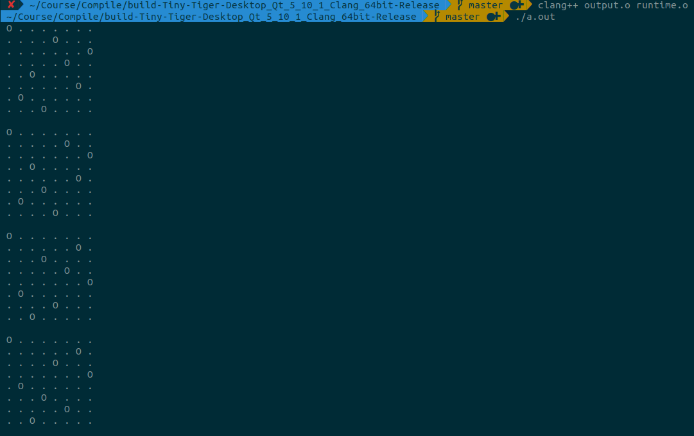
    可以看到运行结果正确。


##十、 分工
* 刘琦：词法分析、语法分析
* 余锦成：语义分析、中间代码生成、目标代码生成
* 方浩： 语法树的可视化、IDE设计


